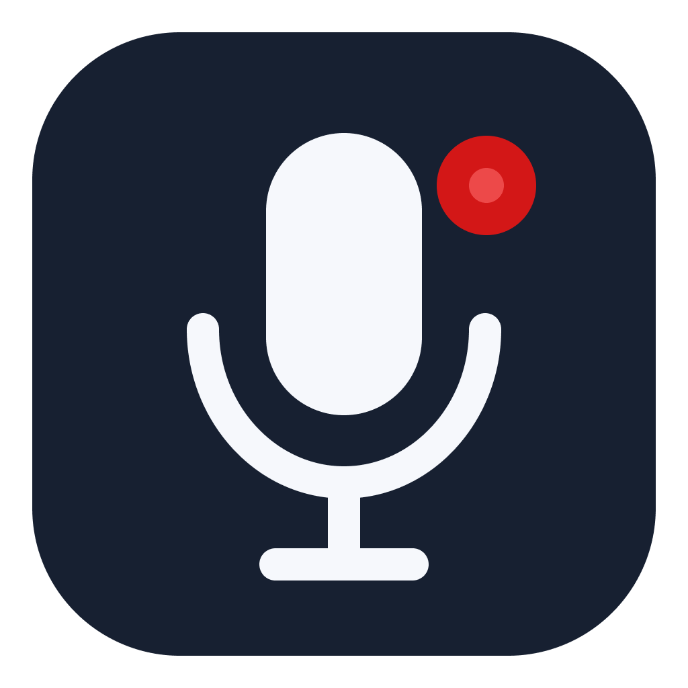
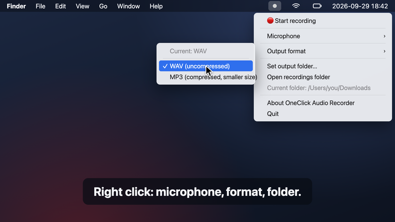

<div align="center">



</div>

# OneClick Audio Recorder

<!-- prettier-ignore-start -->

[](https://github.com/piecioshka/one-click-audio-recorder/actions/workflows/build-all-platforms.yml)
[](#requirements)
[](https://www.electronjs.org/)
[](https://www.npmjs.com/package/ffmpeg-static)
[](#features)
[](https://piecioshka.mit-license.org)

<!-- prettier-ignore-end -->

🎙️ **Capture every thought in one click.**

A tiny dot lives in your menu bar. Click it and you are recording. Click it again and the file is already in your Downloads folder. No window to open, no "new recording" dialog, no account, no cloud.

<p align="center">
  <a href="assets/demo.gif"></a>
</p>

<p align="center"><em>Click the picture to watch the animated demo.</em></p>

> Give a ⭐️ if this project helped you!

## Why

Ideas show up at bad moments: in the middle of a call, while reading, right before you fall asleep. Most recorders make you open an app, find the button and name a file first, and by then half of the thought is gone. OneClick Audio Recorder cuts that down to one click on an icon that is always visible.

## Features

- 🔴 **One click to record** - left click the menu bar dot to start, click again to stop; the dot turns red while recording.
- 💾 **Saved right away** - every recording lands in your output folder (Downloads by default) with a timestamped name, e.g. `audio-recording-2026-09-29T16-42-07-512Z.wav`.
- 🛟 **Nothing gets lost** - quitting mid-recording saves the file first, and a recording cut off by a crash is recovered on the next start.
- 🎚️ **The sound as it is** - records the raw microphone signal with no echo cancellation, noise suppression or automatic gain, so music and room sound survive.
- 🎧 **WAV or MP3** - lossless WAV by default, MP3 when you need small files.
- 🎤 **Any microphone** - follows the system default or sticks to the microphone you pick, e.g. a USB mic or headset.
- 🔒 **Private by design** - works offline and never sends audio anywhere; recordings stay on your disk.
- 🪶 **Out of the way** - no main window and no Dock icon on macOS, just the menu bar dot.
- 💻 **Cross-platform** - macOS, Windows and Linux.

## Download

Get the package for your platform from the [Releases](https://github.com/piecioshka/one-click-audio-recorder/releases) page:

| Platform | Package                               |
| -------- | ------------------------------------- |
| macOS    | `.dmg` or `.zip`                      |
| Windows  | installer (`NSIS`) or portable `.exe` |
| Linux    | `.AppImage`, `.deb` or `.tar.gz`      |

Prefer to build it yourself? See [CONTRIBUTING.md](CONTRIBUTING.md).

### Opening on macOS

The macOS build is not notarized by Apple, so the first launch is blocked with a message that the app cannot be verified. To open it once:

1. Try to open the app, then close the warning.
2. Open System Settings > Privacy & Security, scroll to Security and click **Open Anyway** next to OneClick Audio Recorder.
3. Confirm with **Open**.

Or, from the Terminal, after moving the app to Applications:

```bash
xattr -dr com.apple.quarantine "/Applications/OneClick Audio Recorder.app"
```

macOS remembers the choice, so later launches start normally.

## Usage

1. Launch the app. A dot appears in the menu bar (macOS) or the system tray (Windows, Linux).
2. **Left click** the dot to start recording. It turns red.
3. **Left click** again to stop. The recording is saved to the output folder.
4. **Right click** the dot to:
   - start or stop recording,
   - pick the microphone,
   - switch between WAV and MP3,
   - choose the output folder,
   - open the recordings folder,
   - show the About panel or quit the app.

## Default Settings

| Setting       | Default                       |
| ------------- | ----------------------------- |
| Output folder | Downloads                     |
| Output format | WAV                           |
| Microphone    | the system default microphone |

If the chosen output folder is not writable, recordings go to Downloads.

## Requirements

- macOS, Windows or Linux
- Microphone access for the app

## Permissions

On the first recording your system asks for microphone access. Recording does not work without it. On macOS you can change it later in System Settings > Privacy & Security > Microphone.

## Development

Building, testing and running the app from source is described in [CONTRIBUTING.md](CONTRIBUTING.md).

## License

[The MIT License](https://piecioshka.mit-license.org) @ 2026
